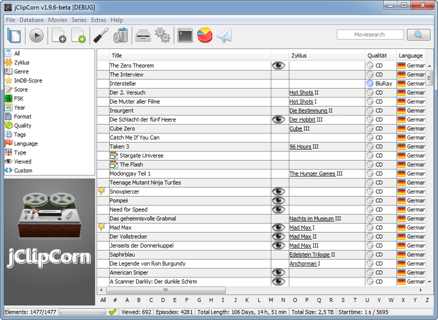

jClipCorn 
------------------
*a portable movie and series manager for Windows and Linux*

> **Disclaimer:**  
> Use this software only in a country which allows for private copies of your bought DVD's.  
> Use this software only to manage copies of movies which you own.  

### Main Features

 - Fully portable - leave the program, the database and the settings on the same *(external)* drive as your movies
 - Multi language (German & English), if you want you can help me translate it into other languages.
 - Parse meta data from the [IMDB](http://www.imdb.com/)
 - Filter your movies by many different criterias (date, genre, name, film series, quality, language, MPAA rating ...)
 - Remember which movies you have watched and where you are in a series
 - Automatically generate nice file names and folder structures for your movies and series
 - Generate statistics from your ClipCorn database
 - Tag and rate your watched movies
 - Works under Windows, Linux *(and probably OS X)*

# [> DOWNLOAD](http://www.github.com/Mikescher/jClipCorn/releases)  
### [> HOMEPAGE](http://www.mikescher.com/programs/view/jClipCorn)  
### [> GITHUB WIKI](https://github.com/Mikescher/jClipCorn/wiki)  
### [> CHANGELOG](https://raw.githubusercontent.com/Mikescher/jClipCorn/master/CHANGELOG.txt)  

### Organization

The idea of ClipCorn is to have all movies in a single folder together with the ClipCorn executable and its database on an external hard drive.  
You can use it in a different way, but for the best user experience it's recommended to follow the organization guide for which this tool was developed.

Every movie is named by a specific pattern. After you have added movies to your database you can rename the files to this pattern with the *"Check Database"* menu entry.
The movies are afterwards named like this:

~~~
Stirb Langsam IV (Part 2).avi
Spongebob - Lost in Time.mpg
Terminator II - Tag der Abrechnung (Part 1).avi
X-Men I.avi
X-Men Origins - Wolverine.avi
X-Men III.avi
Shadowless Sword (Part1).avi
Forrest Gump [Eng].mpg
Terminator II - Tag der Abrechnung [Ger] (Part 1).avi
~~~
*(the exact rules, encoded as an [EBNF](https://en.wikipedia.org/wiki/Extended_Backus%E2%80%93Naur_Form) can be found under the help menu)*

Series have an unique folder per series (with the series name), after that a folder for each season and then files with the file name pattern `SxxExx - %name%`. For example: `S01E07 - You Win or You Die.avi`  
You can create the folder structure for series by right clicking on a series and selecting *"Create folder structure"*

Because series tend to become quite large you can also put them on their own external drive.
A special [format syntax](https://github.com/Mikescher/jClipCorn/wiki/Relative-paths) guarantees that the paths to these series stay valid.

### First start

First copy the executable (either jClipCorn.jar or jClipCorn.exe) into the folder where you have your movies, then execute it (it needs read and write permissions).

On the first start it should create a folder "*ClipCornDB*" where the database is stored.

You can see this in the log view (icon in the bottom status bar, to the right of the progress bar).

At first you should look into the settings and eventually change a few things, important are:

 - UI Language
 - Look'n'Feel (It's recommended to either use *Windows* or *Metal*)
 - VLC Path (path to *vlc.exe*, for playing. You can also use another player - but it works best with the [VLC player](http://www.videolan.org/vlc/))
 - The backup settings (I recommend to **enable** automatic backups *(like every 7 days or so)*)
 - Automatic relative paths (this should really stay active - otherwise paths will be absolute and everything can go havoc if ClipCorn runs on an external drive)

After that you can start adding your movies and series.

### Adding a movie

#### [(go to wiki)](https://github.com/Mikescher/jClipCorn/wiki/Add-new-movie)

### User Interface

#### [(go to wiki)](https://github.com/Mikescher/jClipCorn/wiki/User-Interface)

### Adding a series

#### [(go to wiki)](https://github.com/Mikescher/jClipCorn/wiki/Add-new-series)

### Check Database for errors

#### [(go to wiki)](https://github.com/Mikescher/jClipCorn/wiki/Check-database)
